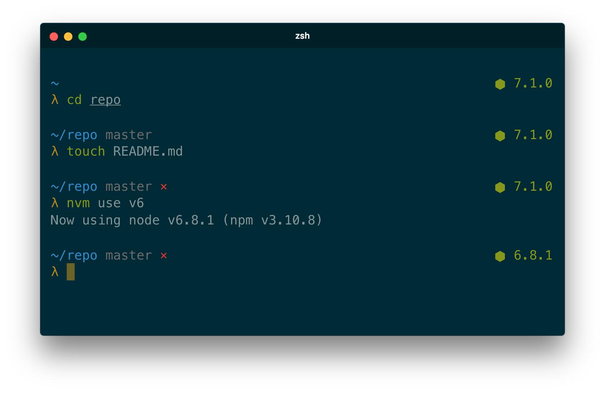
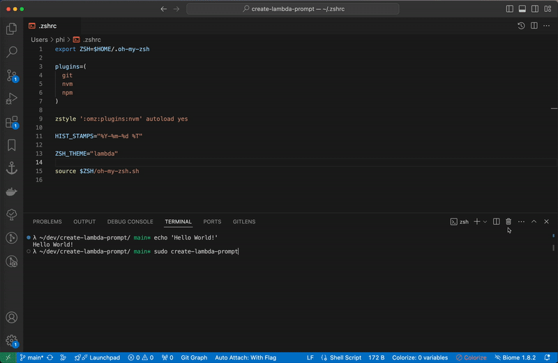

Continue maintaining and publishing [Michał Nykiel](https://github.com/marszall87)'s [lambda-pure](https://github.com/marszall87/lambda-pure) on npm.



## Installation

Requires git 2.0.0+ and ZSH 5.0.0+.

### Automatic method

```console
$ npm install --global create-lambda-prompt
$ sudo create-lambda-prompt
```



### Manual method

1. Copy [src/lambda-prompt.zsh](src/lambda-prompt.zsh) and [src/async.zsh](src/async.zsh) to `/usr/local/share/zsh/site-functions/`.
2. Put the following launch snippet at the end of `~/.zshrc`.

```sh
#...

autoload -U promptinit
promptinit
prompt lambda-prompt
```

### Manual integration

#### [oh-my-zsh](https://github.com/robbyrussell/oh-my-zsh)

1. Copy [src/lambda-prompt.zsh](src/lambda-prompt.zsh) to `~/.oh-my-zsh/custom/themes/lambda-prompt.zsh-theme`.
2. Put `ZSH_THEME="lambda-prompt"` config into `~/.zshrc` like below.

```sh
ZSH_THEME="lambda-prompt" # comes before sourcing oh-my-zsh.sh

source $ZSH/oh-my-zsh.sh # comes before the launch snippet

autoload -U promptinit
#...
```

## Options

```sh
#...
PURE_NODE_ENABLED=0 # comes before lambda prompt's launch snippet

autoload -U promptinit
#...
```

### `PURE_CMD_MAX_EXEC_TIME`

The max execution time of a process before its run time is shown when it exits. Defaults to `5` seconds.

### `PURE_GIT_PULL`

Set `PURE_GIT_PULL=0` to prevent Pure from checking whether the current Git remote has been updated.

### `PURE_GIT_UNTRACKED_DIRTY`

Set `PURE_GIT_UNTRACKED_DIRTY=0` to not include untracked files in dirtiness check. Only really useful on extremely huge repos like the WebKit repo.

### `PURE_GIT_DELAY_DIRTY_CHECK`

Time in seconds to delay git dirty checking for large repositories (git status takes > 2 seconds). The check is performed asynchronously, this is to save CPU. Defaults to `1800` seconds.

### `PURE_PROMPT_SYMBOL`

Defines the prompt symbol. The default value is `λ`.

### `PURE_GIT_DOWN_ARROW`

Defines the git down arrow symbol. The default value is `▼`.

### `PURE_GIT_UP_ARROW`

Defines the git up arrow symbol. The default value is `▲`.

### `PURE_GIT_DIRTY`

Defines the git dirty symbol. The default value is `×`.

### `PURE_NODE_ENABLED`

Set `PURE_NODE_ENABLED=0` to not display the NodeJS version.